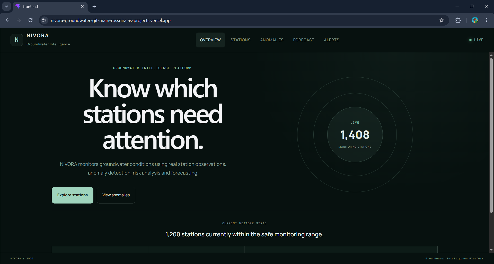
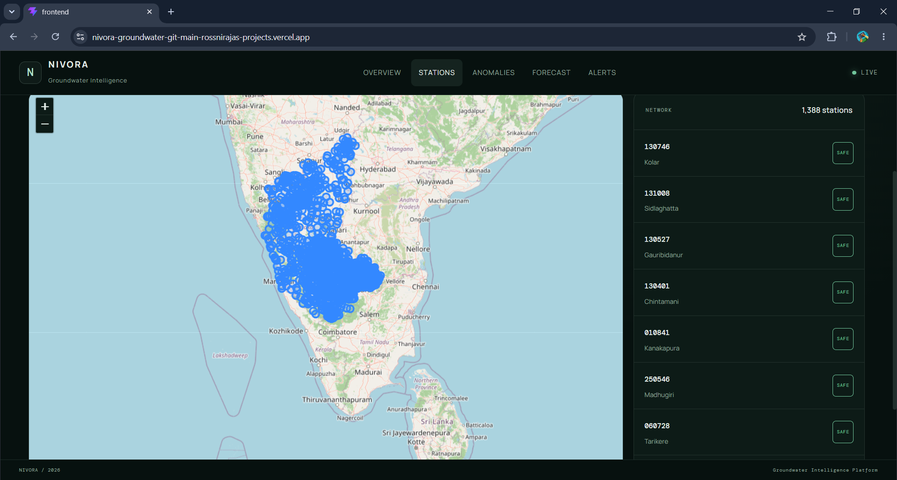
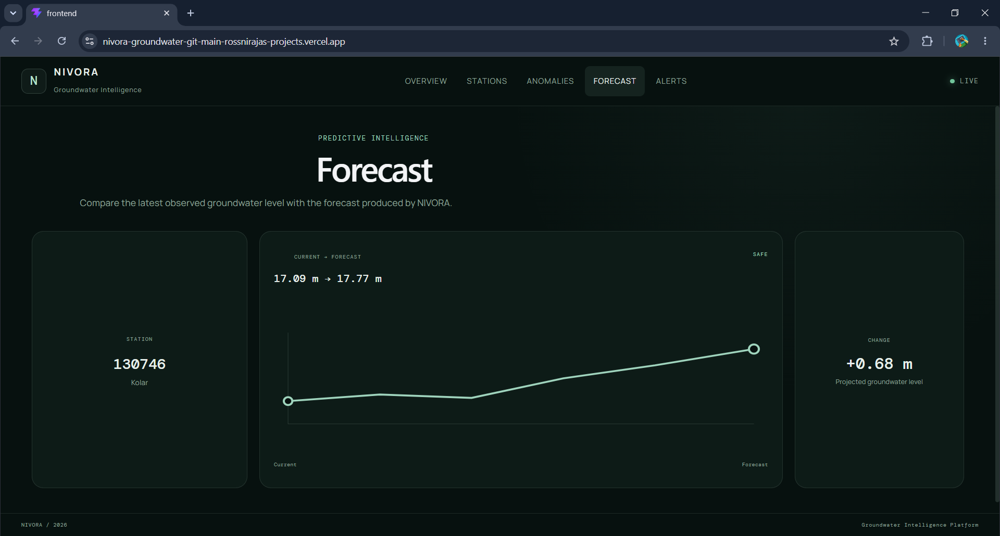
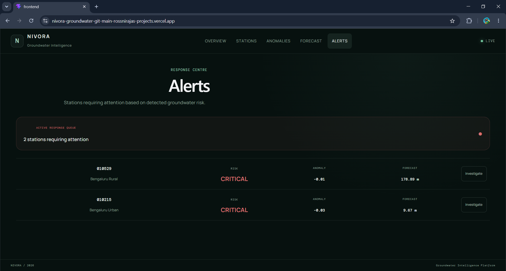

<h1 align="center">NIVORA — Groundwater Intelligence Platform</h1>

<p align="center">
  <strong>Turning groundwater monitoring data into understandable intelligence.</strong>
</p>

<p align="center">
  A full-stack platform that processes groundwater station data, detects anomalies, analyses risk, forecasts water levels, and shows everything on an interactive map.
</p>

<p align="center">

[](https://nivora-groundwater-git-main-rossnirajas-projects.vercel.app/)
[](https://groundwater-anomaly-system.onrender.com/docs)
[](https://github.com/rossniraja/groundwater-anomaly-system)


</p>

<p align="center">
  <a href="https://nivora-groundwater-git-main-rossnirajas-projects.vercel.app/"><b>🌐 Live Demo</b></a> ·
  <a href="https://groundwater-anomaly-system.onrender.com/docs"><b>📘 API Docs</b></a> ·
  <a href="https://github.com/rossniraja/groundwater-anomaly-system"><b>💻 Source Code</b></a>
</p>

---

## 📸 Preview

<p align="center">
  
</p>

<table>
  <tr>
    <td width="50%">
      
      <p align="center"><b>Stations</b> — interactive map and station list with status badges</p>
    </td>
    <td width="50%">
      
      <p align="center"><b>Anomalies</b> — Watch / Warning / Critical counts with per-station scores</p>
    </td>
  </tr>
  <tr>
    <td width="50%">
      
      <p align="center"><b>Forecast</b> — latest observed level compared with the projected level</p>
    </td>
    <td width="50%">
      
      <p align="center"><b>Alerts</b> — stations that currently need attention</p>
    </td>
  </tr>
</table>

---

## 🌊 Overview

**NIVORA** is a full-stack groundwater intelligence platform built to make groundwater monitoring data easier to understand and investigate.

Monitoring measurements go through a data-processing and machine-learning pipeline. The processed results are served by a **FastAPI backend** and presented in a **React frontend**.

Instead of showing raw readings alone, NIVORA answers practical questions:

- What is the current groundwater condition?
- Which monitoring stations need attention?
- Are there unusual changes in groundwater levels?
- What is the current risk level?
- What does the recent trend look like?
- Which direction is the forecast heading?
- Which locations should be investigated first?

---

## ✨ Features

| Feature | What it does |
| --- | --- |
| 📍 **Station monitoring** | Browse 1,000+ monitoring stations on an interactive Leaflet map with a searchable station list |
| 🚨 **Anomaly detection** | Flags stations whose behaviour differs from expected conditions and ranks them by score |
| 🎚️ **Severity levels** | Stations are classified as Safe, Watch, Warning or Critical |
| 🔮 **Forecasting** | Compares the latest observed level with the NIVORA forecast and shows the projected change |
| 🔔 **Alerts** | Dedicated alerts view for stations that need action |
| 🔍 **Investigate** | Jump from an anomaly straight into a station for a closer look |
| 🧩 **REST API** | Every result in the UI is available through documented API endpoints |

---

## 🧭 Pages

| Page | Purpose |
| --- | --- |
| **Overview** | Network-wide summary: total monitoring stations and current network state |
| **Stations** | Map + station list with status badges |
| **Anomalies** | Watch / Warning / Critical counts and stations ranked by anomaly score |
| **Forecast** | Current vs forecast groundwater level for a station, with projected change |
| **Alerts** | Stations that currently need attention |

---

## 🏗️ Architecture

```text
Raw Monitoring Data
        ↓
Data Validation & Cleaning
        ↓
Preprocessing
        ↓
Feature Engineering
        ↓
Anomaly Detection
        ↓
Risk Analysis
        ↓
Forecasting
        ↓
FastAPI Backend  ──►  Hosted on Render
        ↓
React Frontend   ──►  Hosted on Vercel
        ↓
Groundwater Intelligence
```

---

## 🛠️ Tech Stack

| Layer | Technology |
| --- | --- |
| **Language** | Python, JavaScript |
| **Data processing** | pandas, NumPy |
| **Machine learning** | scikit-learn |
| **Backend** | FastAPI |
| **Frontend** | React |
| **Maps** | Leaflet + OpenStreetMap |
| **Deployment** | Vercel (frontend), Render (API) |

---

## 🔗 Important Links

| Resource | Link |
| --- | --- |
| 🌐 Live application | https://nivora-groundwater-git-main-rossnirajas-projects.vercel.app/ |
| 📘 API documentation | https://groundwater-anomaly-system.onrender.com/docs |
| ⚙️ API base URL | https://groundwater-anomaly-system.onrender.com/ |
| 💻 GitHub repository | https://github.com/rossniraja/groundwater-anomaly-system |

> ⏳ The API runs on Render's free tier, so the **first request after a period of inactivity can take 30–60 seconds** while the server wakes up.

---

## 🚀 Run Locally

### 1. Clone the repository

```bash
git clone https://github.com/rossniraja/groundwater-anomaly-system.git
cd groundwater-anomaly-system
```

### 2. Start the backend

```bash
cd backend
python -m venv venv
source venv/bin/activate        # Windows: venv\Scripts\activate
pip install -r requirements.txt
uvicorn main:app --reload
```

The API runs at `http://localhost:8000` and the interactive docs at `http://localhost:8000/docs`.

### 3. Start the frontend

```bash
cd frontend
npm install
npm run dev
```

The app runs at `http://localhost:5173` (Vite default) or `http://localhost:3000` depending on your setup.

---

## 🧠 Engineering Decisions

- **End-to-end pipeline, not a static dashboard.** Data validation, cleaning, feature engineering, detection and forecasting all run before anything reaches the UI.
- **Separate API and frontend.** The FastAPI backend and React frontend are deployed independently, so each can change without breaking the other.
- **Severity levels instead of raw scores.** Watch / Warning / Critical makes results readable for non-technical users, while the underlying score is still shown for analysts.
- **Station-level thinking.** Each station is judged on its own behaviour, because groundwater levels differ hugely across regions.

---

## ⚠️ Current Limitations

Being upfront about what this version does and doesn't do:

- Station coverage is concentrated in **South and Central India** (mainly Karnataka, Tamil Nadu and nearby states), not the whole country.
- Forecasting currently shows a **single projected value per station**, not a full multi-step forecast with confidence intervals.
- The alerts view lists stations needing attention; **automated email/SMS delivery is not yet part of this version.**

---

## 🗺️ Roadmap

- [ ] Historical trend charts per station
- [ ] Multi-step forecast with confidence range
- [ ] Automated email alert delivery
- [ ] Station search and filters by state / district / severity
- [ ] Simplified view for farmers and local communities

---

## 👤 Author

**Rossni Raja**

[](https://github.com/rossniraja)

If you find this project useful, consider giving it a ⭐ on [GitHub](https://github.com/rossniraja/groundwater-anomaly-system).

---

<p align="center">
  <sub>NIVORA / 2026 — Groundwater Intelligence Platform</sub>
</p>
